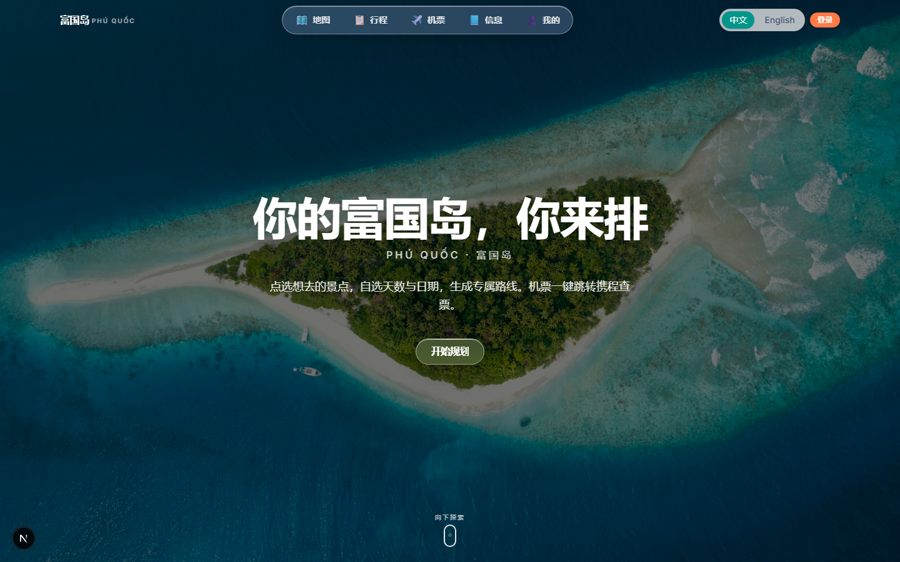
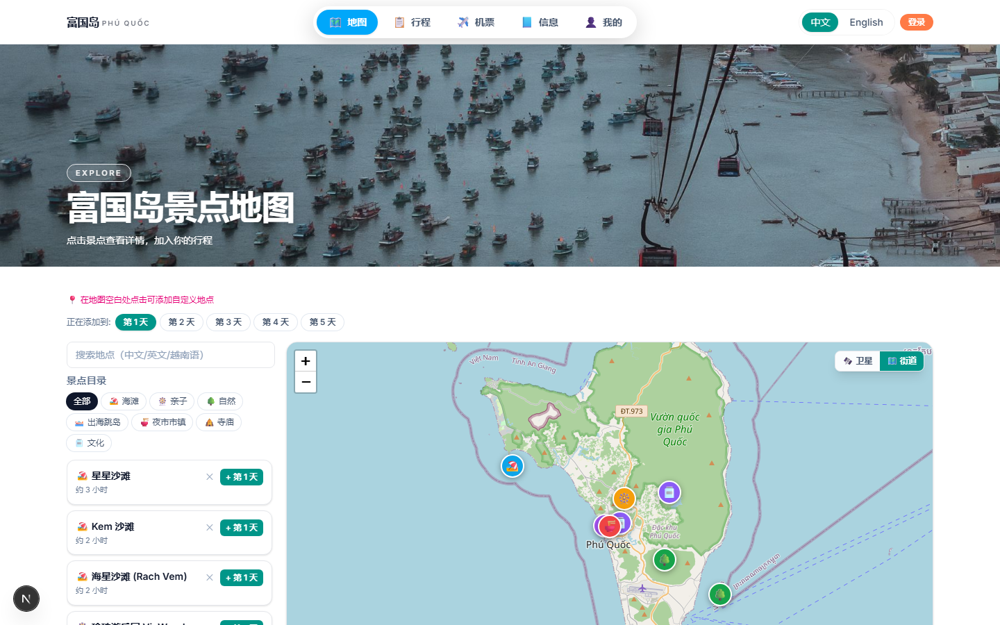
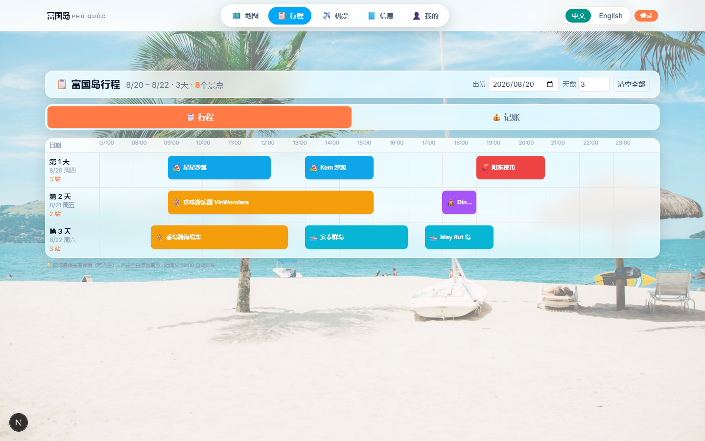
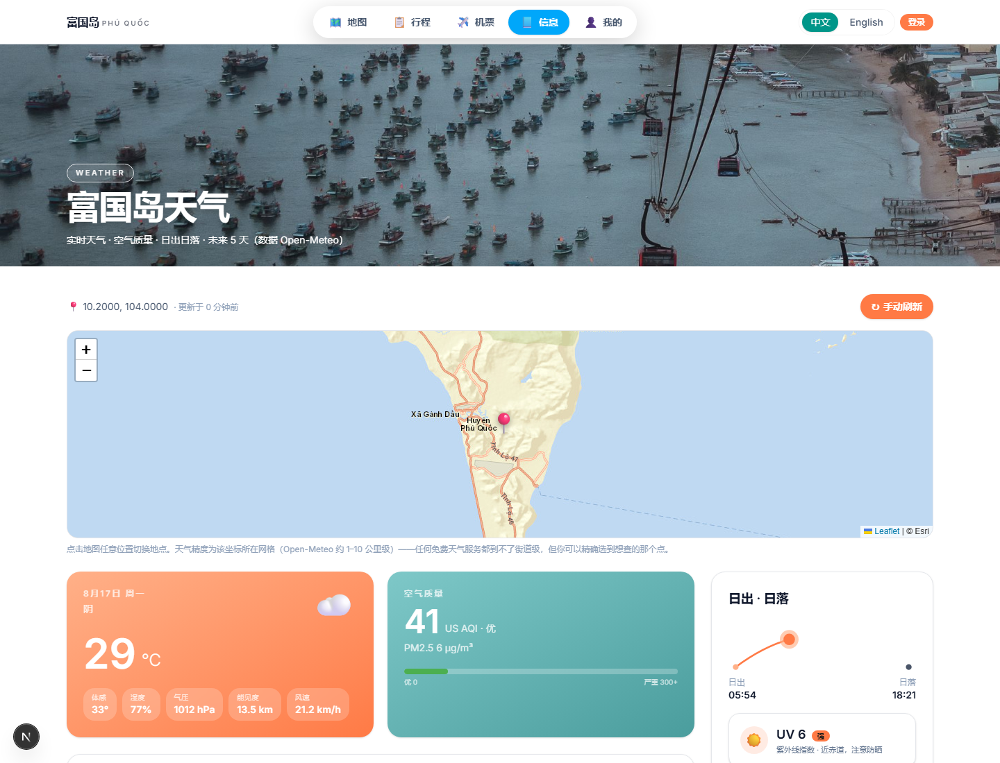
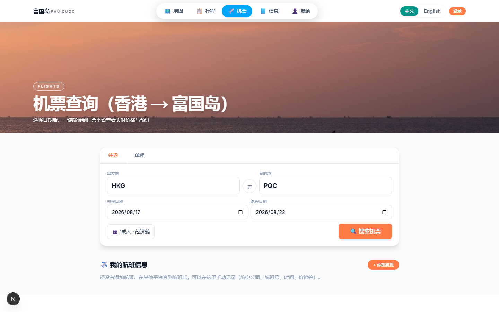
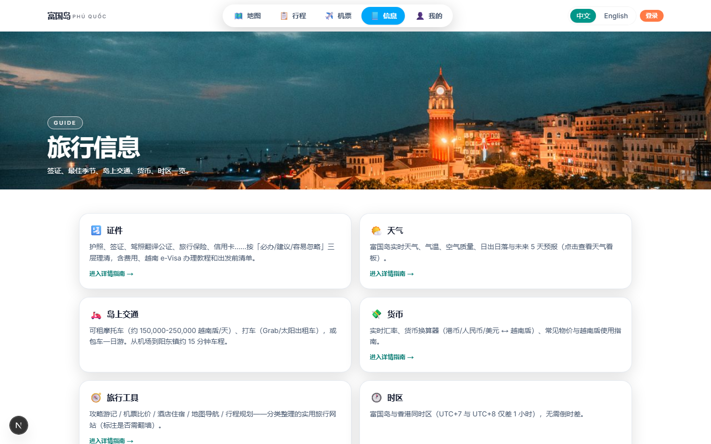

<div align="center">

# 🏝️ 富国岛旅行规划 · Phu Quoc Trip Planner

**点选想去的景点，自选天数与日期，生成专属路线。**

一个为富国岛（Phú Quốc, Vietnam）旅行打造的一站式规划网站——交互式地图选点、拖拽式行程甘特图、实时天气看板、机票比价跳转、多币种记账、证件清单，数据跨设备云同步。


**🔗 在线体验：[phuquoc-travel.netlify.app](https://phuquoc-travel.netlify.app)**

</div>

---

## 📸 界面预览

| 首页 | 地图选点 |
|:---:|:---:|
|  |  |
| **行程甘特图** | **实时天气** |
|  |  |
| **机票查询** | **旅行信息** |
|  |  |

---

## ✨ 功能特性

### 🗺️ 交互式地图
- 基于 Leaflet 的富国岛全岛地图，收录 **14 个精选景点**（海滩 / 亲子 / 自然 / 出海 / 夜市 / 文化）
- 点击地图任意位置添加自定义落点，自动吸附附近已收录景点（<1km）或反向地理编码识别地名
- **OSRM 真实驾车路线** + TSP 路线优化，显示总里程与每段耗时
- Photon 搜索引擎支持中文 / 英文 / 越南语搜索景点
- 卫星图 / 街道图切换，一键跳转 Google Maps 导航

### 📋 拖拽式行程规划
- **横向甘特图**（07:00–23:00），景点 = 彩色色块，宽度按时长比例
- Pointer Events 自由拖拽：按住色块移动到任意时间点（15 分钟吸附）
- **拖右边缘调整时长**，支持跨天拖拽
- 点击空白添加景点 / 自定义事件（名称 + emoji + 时长）
- 悬浮卡片显示详情，支持评价跳转、导航、删除
- 按天分配，最多 14 天行程

### ✈️ 机票查询
- 香港 ↔ 富国岛（HKG ↔ PQC）往返 / 单程
- 一键跳转 Trip.com、Skyscanner、Google Flights 比价
- 支持自定义出发地、舱位、儿童 / 婴儿
- 手动航班信息记录（航空公司、航班号、时间、价格）

### 🌤️ 实时天气看板
- Open-Meteo 数据源（免费、无 Key、国内直连）
- 实时温度 / 体感 / 湿度 / 气压 / 能见度 / 风速
- 空气质量指数（US AQI + PM2.5）
- **Recharts 气温走势图** + 日出日落贝塞尔弧线动画
- 5 天预报 + UV 指数 + 降雨概率
- 地图选点切换查询位置，10 分钟自动刷新

### 💱 货币换算
- 实时汇率（open.er-api.com），支持 HKD / CNY / USD / VND 互转
- 关键汇率卡片 + 富国岛常见物价参考表（自动换算）
- 越南盾使用指南（面额、现金、信用卡、防坑提示）

### 📝 证件准备
- **6 类 36 项**出发前检查清单（证件 / 钱与支付 / 健康安全 / 电子通讯 / 交通 / 衣物）
- 清单可增删改、自定义分类，进度条 + 完成庆祝
- 越南 e-Visa 办理教程（6 步 + 官网 + 视频教程链接）
- 签证类型对比表 + 费用参考

### 💰 旅行记账
- 多币种记账（VND / HKD / USD / CNY），自动换算人民币
- 预算管控（进度条 + 超支红色警示）
- 分类统计图表（餐饮 / 交通 / 住宿 / 景点 / 购物 / 其他）

### ☁️ 账号与云同步
- 邮箱密码注册 / 登录 + Google OAuth
- 行程、记账、清单数据**跨设备自动同步**（Supabase）
- 智能合并策略：本地与云端取并集，按时间戳解决冲突
- localStorage 离线优先，断网不影响使用

### 🎨 其他
- 🌍 **中英文双语**（next-intl，URL 前缀切换）
- 📱 **全面响应式**，手机端触摸拖拽 + 点击操作
- 🪟 液态玻璃 UI（Apple Liquid Glass 风格，照片背景页）
- 🔄 滚动淡入动效（IntersectionObserver，支持 prefers-reduced-motion）
- 📤 数据导出为 JSON

---

## 🛠️ 技术栈

| 类别 | 技术 |
|------|------|
| 框架 | **Next.js 16**（App Router + Turbopack） |
| 语言 | **TypeScript 5** |
| UI | **React 19** + **Tailwind CSS v4** |
| 地图 | **Leaflet** + react-leaflet |
| 状态管理 | **Zustand**（persist 中间件 + localStorage） |
| 国际化 | **next-intl**（中 / 英） |
| 图表 | **Recharts** |
| 后端 / 认证 | **Supabase**（PostgreSQL + RLS + Auth） |
| 部署 | **Netlify**（GitHub 自动部署） |

### 免费数据源（全部无需 API Key）

| 服务 | 用途 | 国内直连 |
|------|------|:---:|
| Open-Meteo | 天气 + 空气质量 | ✅ |
| OSRM | 驾车路线 + TSP 优化 | ✅ |
| Photon (Komoot) | 景点搜索 | ✅ |
| BigdataCloud | 反向地理编码 | ✅ |
| Overpass API | 地点识别 | ✅ |
| open.er-api.com | 汇率换算 | ✅ |
| ArcGIS | 地图瓦片 | ✅ |

---

## 📁 项目结构

```
phuquoc-travel/
├── app/
│   ├── [locale]/            # 国际化路由
│   │   ├── page.tsx         # 首页（hero + 景点画廊）
│   │   ├── map/             # 地图选点
│   │   ├── trip/            # 行程甘特图 + 记账
│   │   ├── flights/         # 机票查询
│   │   ├── info/            # 旅行信息（证件/天气/货币/资源）
│   │   ├── me/              # 个人中心 + 账号同步
│   │   └── auth/            # 登录 / 注册
│   └── api/                 # API 路由（天气/搜索/地点/汇率代理）
├── components/              # React 组件
├── lib/                     # 工具库（store/sync/routing/geocode…）
├── data/                    # POI 数据 + 证件清单数据
├── i18n/                    # next-intl 配置
├── messages/                # zh.json / en.json
├── public/images/           # 富国岛照片 + 景点图片
└── proxy.ts                 # Next.js 16 middleware → Proxy
```

---

## 🚀 本地开发

```bash
# 安装依赖
npm install

# 启动开发服务器
npm run dev
# → http://localhost:3000

# 生产构建（含完整类型检查）
npm run build

# 类型检查
npx tsc --noEmit
```

> ⚠️ Next.js 16 中 middleware 已改名为 `proxy.ts`；`ssr:false` 的 `dynamic()` 只能在 Client Component 中调用。

### 环境变量（可选）

账号云同步功能需要 Supabase。复制 `.env.local.example` 为 `.env.local` 并填写：

```env
NEXT_PUBLIC_SUPABASE_URL=https://your-project.supabase.co
NEXT_PUBLIC_SUPABASE_ANON_KEY=your-anon-key
```

不配置也能正常使用——所有行程数据保存在浏览器 localStorage，仅跨设备同步不可用。

---

## ☁️ 部署

项目已配置 Netlify 自动部署：push 到 `main` 分支即自动构建发布。

如需启用 Supabase 云同步，在 Netlify **Site configuration → Environment variables** 中添加上述两个环境变量。

---

## 📄 License

MIT
